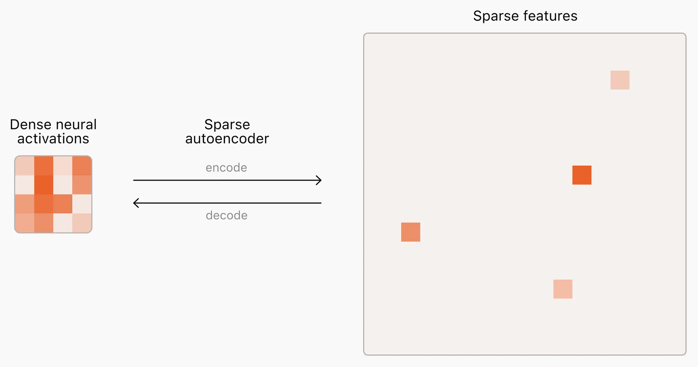
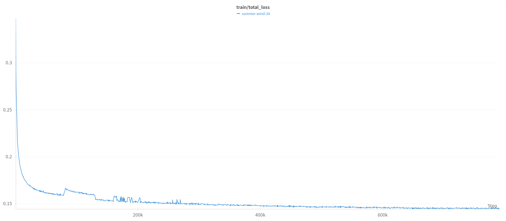
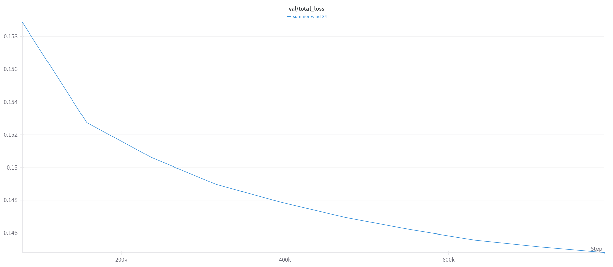
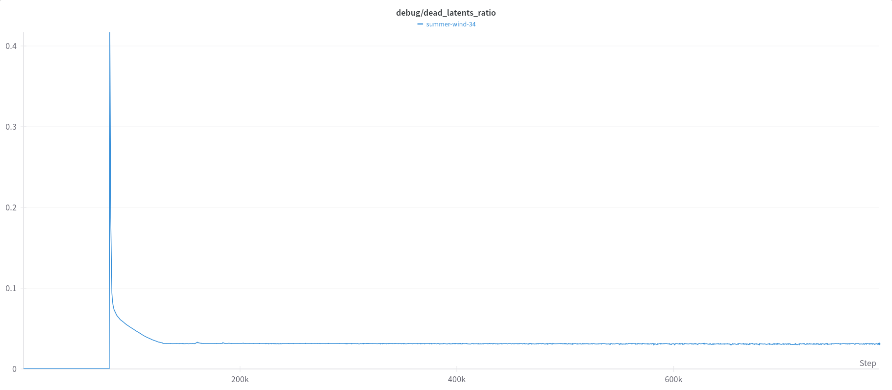
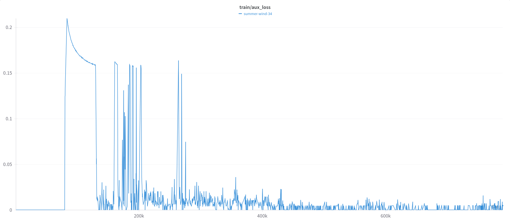

# Llama 3 Interpretability with Sparse Autoencoders

[](https://github.com/PaulPauls/llama3_interpretability_sae)
[](https://www.python.org/downloads/release/python-3120/)
[](https://pytorch.org/)
[](https://ai.meta.com/blog/llama-3-2-connect-2024-vision-edge-mobile-devices/)
[](https://huggingface.co/datasets/PaulPauls/openwebtext-sentences)
[](https://api.wandb.ai/links/paulpauls/pi9dpi2a)

<p align="center">
  
  <br>
  <em>Source: <a href="https://openai.com/index/extracting-concepts-from-gpt-4/">OpenAI - Extracting Concepts from GPT-4</a></em>
</p>


## Project Overview

Modern LLMs encode concepts by superimposing multiple features into the same neurons and then interpeting them by taking into account the linear superposition of all neurons in a layer. This concept of giving each neuron multiple interpretable meanings they activate depending on the context of other neuron activations is called _superposition_. Sparse Autoencoders (SAEs) are models that are inserted into a trained LLM for the purpose of projecting the activations into a very large but very sparsely activated latent space. By doing so they attempt to untangle these superimposed representations into separate, clearly interpretable features for each neuron activation that each represent one clear concept - which in turn would make these neurons _monosemantic_. Such a mechanistic interpretability has proven very valuable for understanding model behavior, detecting hallucinations, analyzing information flow through models for optimization, etc.

This project attempts to recreate this great research into mechanistic LLM Interpretability with Sparse Autoencoders (SAE) to extract interpretable features that was very successfully conducted and published by Anthropic, OpenAI and Google DeepMind a few months ago. The project aims to provide a full pipeline for capturing training data, training the SAEs, analyzing the learned features, and then verifying the results experimentally. Currently, the project provides all code, data, and models that were created by running the whole project pipeline once and creating a functional and interpretable Sparse Autoencoder for the Llama 3.2-3B model.

Such a research project obviously requires a lot of computational resources (meaning money) and time that I don't necessarily have at my full disposal for a non-profit side project of mine. Therefore, the project - as I am releasing it now with version 0.2 - is in a good, efficient, and scalable state, but it is not final and will hopefully be updated and improved upon over time. Please feel free to contribute code or feedback or just let me know if you found a bug - thank you!

This project is based primarily on the following research papers:
* [Scaling Monosemanticity: Extracting Interpretable Features from Claude 3 Sonnet](https://transformer-circuits.pub/2024/scaling-monosemanticity/index.html) (Anthropic, May 2024)
* [Scaling and Evaluating Sparse Autoencoders](https://arxiv.org/abs/2406.04093) (OpenAI, June 2024)
* [Gemma Scope: Open Sparse Autoencoders Everywhere All At Once on Gemma 2](https://arxiv.org/abs/2408.05147) (Google DeepMind, July 2024)

And the Open Source LLM Llama 3.2 that was used for the current state of the project:
* [Llama 3.2: Revolutionizing edge AI and vision with open, customizable models](https://ai.meta.com/blog/llama-3-2-connect-2024-vision-edge-mobile-devices/)
* [Llama Models](https://github.com/meta-llama/llama-models)


### Core Features

A complete end-to-end pipeline from activation capture to Sparse AutoEncoder (SAE) training, feature interpretation, and verification, written in pure PyTorch with minimal dependencies. Specifically:

* Captures residual activations from large language models as SAE training dataset, using a custom sentence-split OpenWebText dataset variant
* Preprocesses training data (prebatching, stat calculation) for efficient training
* Supports distributed (multi-GPU, single-node) large-scale and efficient training of SAEs with captured and preprocessed activation data
* Implements SAE training with auxiliary loss to prevent and revive dead latents, and gradient projection to stabilize training dynamics
* Provides comprehensive logging, visualization, and checkpointing of SAE training through Weights & Biases and console logging, including detailed logs for:
  - Training progress (main/aux loss)
  - Validation results (main/aux loss)
  - Dead latent monitoring for debugging and analysis
* Offers interpretability analysis tools for feature extraction and semantic analysis of learned features by:
  - Capturing inputs that maximally activate the sparse autoencoder latents
  - Cost-effectively analyzing them at scale using a Frontier LLM
* Provides a pure PyTorch implementation of Llama 3.1/3.2 chat and text completion without external dependencies (e.g., Fairscale) for general usage and result verification
* Verifies SAE's impact on model behavior and enables feature steering of extracted semantic features through:
  * Text and chat completion tasks
  * Optional Gradio interface for ease of use
* **All components are designed and implemented with scalability, efficiency, and maintainability in mind**


## Published Resources

The following resource are available to reproduce the results of the current state of the project or to provide insight into the training:

1. [**OpenWebText Sentence Dataset**](https://huggingface.co/datasets/PaulPauls/openwebtext-sentences):
    - Custom Version of the OpenWebText Dataset used for activation capture
    - All text from the original OpenWebText dataset
    - Sentences are stored individually now in parquet format for faster access
    - Maintains all original OpenWebText text and the order thereof
    - Sentences were split using NLTK 3.9.1 pre-trained "Punkt" tokenizer

2. [**Captured Llama 3.2-3B Activations**](https://drive.google.com/drive/folders/1GqMQz3d0z40TRg0codbpt_qacWSPftTZ?usp=sharing):
    - 25 million sentences worth of Llama 3.2-3B layer 23 residual activations
    - Size: 3.2 TB (compressed from 4 TB raw)
    - Split into 100 archives for more manageable download

3. [**SAE Training Log**](https://api.wandb.ai/links/paulpauls/pi9dpi2a):
    - Weights & Biases visualized log of training, validation and debug metrics
    - 10 epochs of training, 10,000 logged steps
    - Includes train/val main losses, auxiliary losses, and dead latent stats during training

4. [**Trained 65,536 latents SAE Model**](https://drive.google.com/file/d/1HEty3WPThHethMsRqS8duhdKrmdawxeu/view?usp=sharing):
    - Final Trained SAE model after 10 epochs with training log specified configuration
    - Trained on 6.5 Billion activations from Llama 3.2-3B layer 23


## Project Structure

The project is organized into four main components:

#### 1. Data Capture
* `capture_activations.py` - Captures LLM residual activations
* `openwebtext_sentences_dataset.py` - Custom dataset for sentence-level processing

#### 2. SAE Training
* `sae.py` - Core SAE model implementation
* `sae_preprocessing.py` - Data preprocessing for SAE training
* `sae_training.py` - Distributed SAE training implementation

#### 3. Interpretability
* `capture_top_activating_sentences.py` - Identifies sentences that maximize feature activation
* `interpret_top_sentences_send_batches.py` - Builds and sends batches for interpretation
* `interpret_top_sentences_retrieve_batches.py` - Retrieves interpretation results
* `interpret_top_sentences_parse_responses.py` - Parses and analyzes interpretations

#### 4. Verification and Testing
* `llama_3_inference.py` - Core inference implementation
* `llama_3_inference_text_completion_test.py` - Text completion testing
* `llama_3_inference_chat_completion_test.py` - Chat completion testing
* `llama_3_inference_text_completion_gradio.py` - Gradio interface for interactive testing


## Installation

```bash
# Install Poetry if not already installed
curl -sSL https://install.python-poetry.org | python3.12 -

# Clone the repository
git clone https://github.com/PaulPauls/llama3_interpretability_sae
cd llama3_interpretability_sae

# Install exact dependencies the project has been run with
poetry install --sync
```


## Implementation Details & Results

#### 1. Custom Llama Implementation

The basis of this research is the custom Llama 3.1/3.2 transformer model implementation in [`llama_3/model_text_only.py`](llama_3/model_text_only.py). It is based on the reference implementation from the llama models repository, however I've made several significant modifications to better suit this project. I rewrote the implementation to remove the heavy dependency on the Fairscale library - simply because I am not familiar with it and much more comfortable working directly with PyTorch, thereby hoping to avoid bugs or performance bottlenecks stemming from working with a library I am not familiar with. Similarly, I stripped out the multimodal functionality since investigating image interpretability would have added unnecessary complexity for this initial release.
The modified Llama 3.1/3.2 model implementation includes new constructor options that enable either activation capture or the injection of a trained Sparse Autoencoder (SAE) model at specific layers during inference. This functionality is implemented through the following constructor parameters:
```python
class Transformer(nn.Module):
    def __init__(
        self,
        params: ModelArgs,
        store_layer_activ: list[int] | None = None,
        sae_layer_forward_fn: dict[int, callable] | None = None,
    ):
```
For the supporting code in the [`llama_3/`](llama_3/) directory, I made a pragmatic decision to keep most of the auxiliary files from the original Llama models repository unchanged. 95% of this auxiliary code is unused and only needed for the chat formatter, which is very dependent on interconnected imports. However, since it wasn't research critical did I decide not to rewrite it and simply carry over the files over.
The actual inference implementation is custom and contained in my [`llama_3_inference.py`](./llama_3_inference.py) module, which provides streaming capabilities for both chat and text completion tasks and will be primarily of use when testing and validating the results. The implementation allows for batched inference and features configurable temperature and top-p sampling parameters, with an automatic fallback to greedy sampling when the temperature is set to 0.


#### 2. Data Capture

For the data capture I created a custom variant of the [OpenWebText](https://huggingface.co/datasets/Skylion007/openwebtext) dataset that processes text at the sentence level, capturing 25 million sentences with a maximum length of 192 tokens each. This extensive data collection resulted in 4TB of raw activation data, which compresses to 3.2TB of tar.gz archives. In total I captured approximately 700 million activations from these 25 million contexts, with sentences averaging 27.3 tokens in length.

While this dataset is roughly an order of magnitude smaller than those used by Anthropic or Google DeepMind (who both utilized around 8 billion unique activations), it still provides a substantial foundation for training an initial SAE model in my opinion. To compensate for the smaller dataset size I trained the SAE for 10 epochs, effectively processing the same number of total activations as Anthropic and Google DeepMind - the key difference being that my SAE encounters each activation 10 times instead of only once. This approach was simply a monetary constraints for a non-profit side project, as scaling to match their single-epoch approach would have increased my GCP bucket costs from approximately $80/month (for 3.2TB w/ traffic) to $800/month (for 32TB w/ traffic), not to mention the significantly higher costs for instance SSDs during training.

The decision to process data at the sentence level was deliberate and grounded in several key considerations. Sentences represent natural linguistic units that contain complete thoughts and concepts, which I hope would lead to more interpretable and semantically meaningful features. This approach avoids artificial truncation of context and prevents _contextual bleed_ of meanings across sentence boundaries, while still capturing essential contextual relationships within grammatically complete units. My thinking was that this makes it easier to attribute discovered features to specific linguistic or semantic phenomena. This approach was also chosen so that the training dataset contains activations adapted to the same linguistic units that I later intended to use for the interpretability analysis.

Furthermore I specifically chose to process sentences without the 'beginning-of-sequence' (bos) token to avoid position-specific patterns, as my goal was to interpret features based on their meaning alone, independent of their position in a sequence. Since sentences represent natural semantic units that provide sufficient context for meaningful interpretation while remaining specific enough to identify distinct concepts, this aligns well with the goal of having a LLM analyze the semantic content that activates specific latents.

From a technical implementation perspective, I captured residual stream activations after layer normalization from Llama 3.2-3B, specifically from layer 23 out of 28 (positioned just short of 5/6th through the model's depth, following OpenAI's implementation). The capture process utilizes a distributed implementation using NCCL for single-node multi-GPU inference, with asynchronous disk I/O handled through a separate process to prevent GPU processing bottlenecks. The entire data capture process took approximately 12 hours using 4x Nvidia RTX4090 GPUs.

OpenAI's implementation also uses residual stream activations after layer normalization, with a context length of 64 tokens and sampling 5/6th-way throughout the GPT-4 model (though they sample more toward the middle layers for smaller models). Anthropic's implementation differs more substantially, using 8 billion MLP activation vectors from 40 million contexts (250 tokens per context) and applying them to residual stream activations at the middle layer of the Claude 3 Sonnet model. In hindsight, there could be a potential for improvement when capturing earlier layers in the next experiments for a relatively small 3B parameter model.


##### _Data Preprocessing_

I am personally a big fan of data preprocessing if complicated batching is necessary. In this case, the challenge was to create batches of 1024 activations each, while handling activations of variable sequence lengths that necessitate carryover handling, potentially in a multiprocessing context. Given the high risk of batching bugs or I/O-related performance bottlenecks, I made the decision to implement a preprocessing phase rather than handling these complexities during training.

Since preprocessing was already necessary, I also took the opportunity to calculate the mean tensor across all activations using Welford's algorithm. This algorithm was specifically chosen for its numerical stability and memory efficiency when processing very large datasets. The calculated mean serves as the initial value for the `b_pre` bias term in the SAE model. While OpenAI's implementation uses the geometric median instead of the mean for initializing `b_pre`, they only compute it for the first ~30,000 samples of their dataset rather than the complete set and given that the `b_pre` is optimizable anyway, I decided that using the mean as an initial approximation would be sufficient.

The entire preprocessing pipeline is implemented with full CPU parallelization through multiprocessing, ensuring efficient processing of the large activation dataset. This approach simplifies the training process by providing clean, pre-batched data.


#### 3. SAE Implementation

##### _SAE DESIGN_

The core of the Sparse Autoencoder implementation follows a straightforward encoder-decoder architecture with design choices following mainly the choices made by OpenAI. The full forward pass of the TopK Autoencoder includes two key bias terms: `b_pre` for both encoder and decoder (initialized as the mean calculated in the preprocessing as outlined in the prior section), and `b_enc` specifically for the encoder (initialized randomly). The complete forward pass can be described as:

Encoder: `h = TopK(W_enc(x - b_pre) + b_enc)`

Decoder: `x^ = W_dec * h (+ h_bias) + b_pre`

Sparsity in the latent space is enforced through the TopK activation function, which retains only the k largest activations and sets the rest to zero. This approach directly controls sparsity without requiring an L1 penalty term for sparsity in the loss function as required by Anthropic's approach. The model includes an optional `h_bias` parameter that remains disabled during training but can be activated afterwards for feature steering, allowing dynamic manipulation of the latent space post-training.

For numerical precision I chose to work with float32 dtype due to its quick and precise conversion compatibility with Llama's required bfloat16 dtype. Both formats share the same 1 sign bit and 8 exponent bits structure, differing only in their mantissa bits (23 vs 7), making conversions quick and accurate.

My implementation differs from both Anthropic's and OpenAI's approaches in several ways. Anthropic uses a one-hidden-layer MLP with ReLU activation and enforces sparsity through an L1 penalty instead of TopK. They also worked with massively larger latent sizes (~1M, ~4M, and ~34M features), though their average number of active features per token remained below 300 for all SAEs. OpenAI's architecture is more similar to my implementation, but they experimented with latent sizes from 2^11 (2,048) up to 2^24 (16.7M) for GPT-4. Their experiments showed that larger latent sizes generally produced better loss and feature explainability, while lower k values (fewer active latents) led to more interpretable features.

For this project - working with the 3B parameter Llama 3.2 model with a residual stream dimension of 3,072 - I chose a latent dimension of 2^16 (65,536) and a k value of 64. This decision aims to strike a balance between several factors: providing sufficient feature capacity at approximately 21x the residual stream dimension, maintaining computational efficiency as suggested by the OpenAI and Google DeepMind papers, and staying within the project's monetary constraints when training on ~8 billion activations for comparability. The k value of 64 was selected to achieve a good balance between reconstruction power and the strong sparsity needed for interpretable features.

In hindsight however, as I outline in [section 6](#6-future-work--improvements), I would considerably increase the latent size and decrease the k value for future experiments to improve the variety and interpretability of the features and attempt to find efficiency improvements to stay within budget constraints. As a first full run of the project, I am however very happy with the chosen hyperparameters and results.


##### _SAE TRAINING METHODOLOY_

The training configuration of the Sparse Autoencoder was chosen to balance efficiency and feature interpretability. The core hyperparameters reflect both the model architecture and the training dynamics:

```python
# Set up configuration
d_model = 3072
n_latents = 2**16  # 65536
k = 64
k_aux = 2048
aux_loss_coeff = 1 / 32
dead_steps_threshold = 80_000  # ~1 epoch in training steps
sae_normalization_eps = 1e-6
batch_size = 1024
num_epochs = 10
early_stopping_patience = 10  # disabled
learning_rate = 5e-5
learning_rate_min = learning_rate / 5
optimizer_betas = (0.85, 0.9999)
optimizer_eps = 6.25e-10
dtype = torch.float32
dataloader_num_workers = 8
logs_per_epoch = 1000
train_val_split = 0.95
```

The loss function combines a main reconstruction loss resulting from the reconstruction error with a complex auxiliary loss designed to prevent and revive dead latents in the following way: `total_loss = main_loss + aux_loss_coeff * aux_loss`. Following OpenAI's approach, I set `aux_loss_coeff = 1/32`. Both losses are computed in normalized space to ensure equal contribution from all features regardless of their original scale, which helps maintain numerical stability throughout training.

The auxiliary loss was proposed by OpenAI and plays a crucial role in preventing dead latents through a clever mechanism: it calculates the MSE between the main reconstruction residual (the difference between input and main reconstruction) and a special auxiliary reconstruction. This auxiliary reconstruction uses the same pre-activation latent as the main reconstruction, but it takes only the top-(aux-k) activation values from latents that haven't fired recently (which is tracked through the shared `stats_last_nonzero` tensor) and sends them through the decoder again to get this 'auxiliary reconstruction'. This gives these `k_aux = 2048` inactive latents that haven't even activated during the actual training where only the top `k` latents are used for the reconstruction a dedicated learning signal to capture information missed by these main latents. This makes the dead latents more likely to activate in future forward passes and thereby allows for reviving dead latents, keeping all latents alive and useful.

The training only consider dead latents for the auxiliary loss. A latent is considered dead if it hasn't been activated in `dead_steps_threshold` training steps (set to 80,000 steps, approximately one epoch in my setup), which equates to no activation in the reconstruction of the last ~650M activations given a batch size of 8192. This threshold serves two purposes: it ensures the main loss has sufficient warm-up time before receiving an auxiliary loss signal, and it guarantees that we only attempt to revive latents that haven't fired once after seeing all unique training data activations.

The training infrastructure employs distributed training using the NCCL backend for a single-node multi-GPU setup. Using 8x Nvidia RTX4090 GPUs for 10 epochs with a per-GPU batch size of 1024 (effective batch size 8192), I processed approximately 7 billion activations over a span of a little over 7 days. The number of epochs was chosen to match the total number of processed activations in Anthropic's and Google DeepMind's experiments. All training progress, including losses and debugging statistics about dead latents, was tracked comprehensively via Weights & Biases.

The parameters of the optimzier were carefully tuned for the specific challenges of training a sparse autoencoder where some features activate extremely rarely. I chose a base learning rate of 5e-5 after comparative testing showed it achieved similar optimization speed to higher rates while promising better fine-tuning potential for sparse features in later training stages. The learning rate follows a cosine annealing schedule down to a minimum of 1e-5 (1/5 of initial).
The AdamW configuration required special consideration for the sparse nature of the autoencoder:

* `beta_1 = 0.85` (lower than the typical 0.9 to make individual updates more meaningful given the large effective batch size of 8192 and sparse nature of the autoencoder)
* `beta_2 = 0.9999` (accommodates sparse activation patterns where some features might activate very rarely and therefore need longer momentum preservation)
* `eps = 6.25e-10` (provides sufficient numerical stability for float32 precision while allowing precise parameter updates needed for optimizing rare activation patterns)

Weight initialization and normalization were implemented with particular attention to training stability as recommended by the OpenAI paper. The encoder and decoder weights are initialized orthogonally (with the decoder as the transpose of the encoder) to ensure balanced, independent initial feature directions. Input features are normalized with a small epsilon term for training robustness. Following empirical findings from both the OpenAI paper and [Bricken et al. [2023]](https://transformer-circuits.pub/2023/monosemantic-features), the decoder weights are explicitly normalized to unit norm after initialization and each training step, as this improves MSE performance.

A key implementation detail is the gradient projection via `project_decoder_grads()`, which maintains the unit-norm constraint on decoder weights by removing gradient components parallel to existing dictionary vectors. This projection helps stabilize training and prevents the autoencoder from learning redundant or degenerate features when identifying sparse patterns in the data:
```python
def project_decoder_grads(self):
    """Project out gradient information parallel to dict vectors."""
    # Compute dot product of decoder weights and their grads, then subtract the projection from the grads
    # in place to save memory
    proj = torch.sum(self.decoder.weight * self.decoder.weight.grad, dim=1, keepdim=True)
    self.decoder.weight.grad.sub_(proj * self.decoder.weight)
```

My implementation differs from both Anthropic's and OpenAI's approaches in several ways. Anthropic uses a combination of L2 reconstruction error and L1 regularization for sparsity, implements periodic neuron resampling for dead neurons and modifies gradient updates for decoder weight normalization. While they used the same batch size of 8192, their approach to maintaining sparsity and handling dead neurons is quite different from my TopK implementation.

OpenAI's implementation is much closer to mine but uses different Adam optimizer settings (`beta_1 = 0.9`, `beta_2 = 0.999`), maintains a constant learning rate, implements gradient clipping for stability and considers neurons dead much earlier (no activation after 10M tokens). They also use an EMA of weights instead of raw optimization weights and opted for an extremely large batch size of 131,072 tokens.


##### _SAE TRAINING RESULTS_

The training process ran for ~7 days on 8x Nvidia RTX4090 GPUs, demonstrating stable and efficient convergence throughout. The training progression showed a nice logarithmic decay in the loss function, ultimately achieving a final total normalized loss of approximately 0.144:

<p align="center">
  
  <br>
  <em>Fig 1: SAE Training - Total Loss</em>
</p>

The validation loss was computed on a held-out 5% of the training data and exhibited a similar logarithmic decay pattern, though predictably less steep than the training loss:

<p align="center">
  
  <br>
  <em>Fig 2: SAE Training - Validation Loss</em>
</p>

A particularly interesting aspect of the training dynamics emerged after the initial warm-up period of 80,000 training steps. At this point, about 40% of the latents were identified as "dead" - meaning they hadn't activated once so far. However, the auxiliary loss mechanism proved remarkably effective at reviving these dead latents quickly:

<p align="center">
  
  <br>
  <em>Fig 3: Dead Latents Ratio - Rapid decrease after warm-up period, stabilizing at minimum threshold</em>
</p>

The auxiliary loss started quite high but also showed quick decay as it successfully revived dead latents:

<p align="center">
  
  <br>
  <em>Fig 4: SAE Training - Aux Loss</em>
</p>

An interesting implementation detail emerged regarding the auxiliary loss calculation: it only triggers when at least k_aux (2,048) latents are dead, effectively establishing a soft lower bound of dead latents at approximately 3% (2,048/65,536), which is very visible in Figure 3. I initially implemented this condition as an optimization to avoid unnecessary auxiliary loss calculations when few latents were dead. Surprisingly to me, the auxiliary loss mechanism was so effective at reviving dead latents that it consistently drove the dead latent count toward this lower bound, particularly in the later stages of training where the auxiliary loss was frequently zero due to insufficient dead latents to trigger the calculation.

One reason why I was surprised by such an effective revival of dead latents was that I expected a much higher percentage of dead latents. Anthropic and OpenAI both reported up to 65% dead latents in certain configurations, though admittedly their latent size was 1 to 2 orders of magnitude larger than mine. The effectiveness of the auxiliary loss implementation, combined with the gradient projection technique for stabilizing training dynamics appears to create a very robust training. For future experiments though, removing the minimum dead latents threshold for auxiliary loss calculation could potentially allow for even fewer dead latents, though I am happy with the results of the current implementation.


#### 4. Interpretability Analysis

The interpretability analysis approach builds upon methods established in Anthropic's research on scaling monosemanticity, but with a key difference in granularity. While Anthropic primarily focused on single-token analysis, this implementation captures and analyzes complete sentences - specifically the top 50 sentences that most strongly activate each latent. The activation strength is calculated using a mean and last-token aggregation across all tokens in a sentence, which is intended to hopefully provide a more holistic view of semantic activation patterns in Llama 3.2-3B's intermediate layers.

As I already addressed in [section 2](#2-data-capture), the decision to use sentence-level analysis instead of token-level analysis was deliberate and based on the hopes of combining linguistic principles with a simple approach for a first release. Sentences represent natural linguistic units that contain complete thoughts and in my opinion provide a great balance between context and specificity. This approach prevents both the artificial truncation of context and the potential mixing of meanings across sentence boundaries (_contextual bleed_). To aggregate all latent activations in a sequence I primarily chose to rely on 2 methods:

* `mean` aggregation to hopefully reveal features that maintain a consistent activation throughout a sentence, highlighting a sustained semantic theme
* `last` aggregation (simply taking the last token's activations) to hopefully leverage an LLMs autoregressive nature and capture the final representation that has seen the whole sentence through self-attention

For the semantic analysis itself, I utilized the most advanced frontier LLM that is available to me at the time of this project: Claude 3.5 (specifically `claude-3-5-sonnet-20241022`) with a structured chain-of-thought prompt. I employed an automated approach that allows for scalable interpretation while hopefully maintaining semantic specificity. The prompt is supposed to guide Claude through specific analysis steps for all 50 supplied sentences:

1. Identify key words and phrases
2. Group thematic elements
3. Consider potential outliers
4. Provide a final semantic interpretation with a confidence score

This analysis pipeline is implemeneted in the three stages of _sending analysis requests in cost-effective batches_, _retrieving responses_, and _parsing and processing the semantic interpretations_. All intermediate data is preserved for reproducibility and further analysis:

* Raw sentences, their activation aggregations, and OpenWebText indices are stored in [`capture_top_sentences/`](captured_top_sentences/)
* Unprocessed semantic analysis responses are saved in [`top_sentences_last_responses/`](top_sentences_last_responses/) and [`top_sentences_mean_responses/`](top_sentences_mean_responses/)
* Processed results mapping latents to their identified 'common_semantic' and 'certainty score' are stored in [`latent_index_meaning/`](latent_index_meaning/)

To illustrate the analysis process let's take a look at latent #896, which was identified as representing "References to United Nations institutions, personnel, operations, or official documentation using formal institutional terminology". Claude's detailed analysis included:
```text
<semantic_analysis>
1. Key Word Analysis:
    - Frequent terms: "UN", "United Nations", "Secretary-General"
    - Official titles: "Special Rapporteur", "Under-Secretary-General", "Coordinator"
    - Department names: "UNDP", "UNHCR", "OCHA", "UNODC"

2. Thematic Grouping:
    - UN organizational structure references
    - UN personnel and positions
    - UN reports and documentation
    - UN agencies and bodies
    - UN operations and activities

3. Pattern Analysis:
    - All sentences reference UN entities, personnel, or activities
    - Formal institutional language
    - Heavy use of official titles and department names
    - References to official documents and reports

4. Strength Assessment:
    - 50 out of 50 sentences contain direct UN references
    - Mix of department names, personnel titles, and activities
    - Consistent institutional terminology
    - No outliers identified

5. Certainty Calculation:
    - 100% of sentences contain UN references
    - Very strong institutional terminology consistency
    - Clear organizational focus
    - Direct and explicit connections

The analysis reveals that every sentence relates to United Nations organizations, personnel, operations, or documentation, with extremely consistent institutional terminology and structure. The commonality is both obvious and comprehensive.
</semantic_analysis>

{
    "common_semantic": "References to United Nations institutions, personnel, operations, or official documentation using formal institutional terminology",
    "certainty": 1.0
}
```

From a cost perspective, this interpretability analysis proved remarkably efficient compared to the dataset capture, storage, and SAE training phases. Processing 24,828,558 input tokens and generating 3,920,044 output tokens with Claude 3.5 in batch mode cost only $66.74.

While this approach to semantic analysis is relatively straightforward, it was chosen as a solid initial method for both feature interpretation and potential feature steering. The sentence-level analysis helps avoid uncertainties around when specific latents should be activated, though this simplicity does certainly come at the cost to result quality. I considered developing more sophisticated interpretation methods, but this seemed like a complex research challenge that could potentially be debated and refined for months. Anthropic for example is not only publishing great papers on this topic but also consistently high quality blog posts about it for years at [transformer-circuits.pub](https://transformer-circuits.pub/). So for this initial release, I opted for a simpler approach that validates my full pipeline first before potentially making improvements on it in the future.

So as outlined, my approach differs intentionally quite considerably from both Anthropic and OpenAI in several key aspects:

Anthropic's approach to interpretability focuses on analyzing individual token activations in Claude 3 Sonnet, working with sparse autoencoders containing up to 34M features. Their methodology combines manual feature inspection with comprehensive validation through steering experiments and ablation studies. The validation protocol specifically examines feature interactions, activation patterns, and the impact of feature manipulation on model behavior. This multi-faceted approach allows them to verify both the existence and significance of identified features while providing insights into how these features contribute to the model's overall behavior.

OpenAI's implementation similarly focuses on individual token activations but takes a different approach to analysis, examining both specific activations and random activating examples. Their methodology emphasizes automated interpretability at scale utilizing a lot of technical metrics. These include probe loss measurements, N2G (Neuron to Graph) pattern matching for feature identification, and multiple quality assessment metrics such as downstream loss, ablation sparsity, and explanation precision/recall. Furthermore OpenAI is also very systemic in assessing the quality of the detected features, using multiple quantitative metrics to evaluate the reliability and usefulness of identified features.


#### 5. Verification and Testing

The verification and testing infrastructure consists of three main components designed to analyze and validate the SAE's impact on model behavior:

* `llama_3_inference_chat_completion_test.py`
* `llama_3_inference_text_completion_test.py`
* `llama_3_inference_text_completion_gradio.py`

These scripts enable both feature activation analysis and feature steering through text and chat completion tasks. Each implementation supports batched inference (considering each line a separate batch element), configurable temperature and top-p parameters, and most importantly the ability to inject a trained SAE model for feature analysis and steering.

The semantic meanings and certainty scores for each latent - derived in the earlier interpretability analysis in [section 4](#4-interpretability-analysis) - are stored in the [`latent_index_meaning/`](latent_index_meaning) directory. These processed results serve as the basis for both feature activation analysis and steering experiments. To demonstrate the practical application of these tools, let's look at a concrete example using four sample input prompts, text completed in the terminal-UI with settings `max_new_tokens=128, temperature=0.7, top_p=0.9, seed=42`, demonstrated in figure 5:

```text
The delegates gathered at the
Foreign officials released a statement
Humanitarian staff coordinated their efforts
Senior diplomats met to discuss
```

<p align="center">
  
  <br>
  <em>Fig 5: Terminal UI inference without feature steering</em>
</p>

Aside from feature activation analysis it is also possible to perform feature steering experiments with the same sample sentences and configuration. While this is also possible in the terminal UI does figure 6 show such a feature steering using the gradio UI for the sake of demonstration. In this example the latent #896 is targeted, which earlier analysis identified as representing "References to United Nations institutions, personnel, operations, or official documentation using formal institutional terminology". By increasing this latent's activation value by 20 through the dynamically adjustable `h_bias` (see [section 3.1](#_sae-design_) for a reminder of the placement of `h_bias`) can the model's text completion successfully be steered toward UN-related content.

<p align="center">
  
  <br>
  <em>Fig 6: Gradio UI inference with feature steering towards UN-related content</em>
</p>

The feature steering is not particularly strong in this first beta version of the project, hence why in the example above only the second and third sentence are flipping over to UN related content. Because of this the sample prompts were also chosen so that the start of the text completion provides a chance that the completion can be steered towards the United Nations, as for example feature steering towards the UN for a sentence that starts with "For any n, if 2n - 1 is odd" would certainly fail.

This limitation of feature steering stems from the focus on feature extraction rather than steering optimization during interpretability analysis. However while this means that the steering capabilities produce inconsistent results, is it worth emphasizing that feature extraction alone provides valuable insights into the model. Therefore I just consider the ability to also perform feature steering a nice additional showcase and interesting demonstration in this first project release.


#### 6. Potential Future Work & Improvements

* Expanding the latent dimension to at least 2^18 (262,144) features while reducing k to 32. This would provide more capacity for discovering unique features while maintaining stronger sparsity, potentially leading to more interpretable and monosemantic features. The increased computational demands would need to be offset somehow, by potentially increasing efficiency or implementing things like gradient accumulation.
* Implementing comprehensive activation tracking of the latents, e.g. by often logging the state of the `latent_last_nonzero` tensor throughout training, rather than just using the basic debug logs I used so far. This would provide deeper insights into how and when latents become active or die and how their activation is distributed.
* Adding support for analyzing feature interactions despite sparsity by tracking co-activation patterns in the latent space. Understanding how features work together could provide insights into more complex semantic representations and could potentially improve both interpretability and steering capabilities.
* Developing more sophisticated interpretability analysis methods, particularly in grouping high-activating sentences and n-grams. While the current sentence-level analysis provides a good foundation, more nuanced approaches to pattern recognition could reveal subtler semantic features and improve our understanding of how the model represents information.
* Similarly, also performing not only feature extraction interpretability analysis but also feature steering interpretability analysis, though admittedly in sufficiently sophisticated methods this would both coincide.
* Extending the research to include Llama 3.1-8B model activations. Since it shares the same codebase as Llama 3.2, this would be a very straightforward extension that would essentially only require an adaptation of the hyperparameters and a lot of compute power.
* Experimenting with different activation capture points, varying from depth into the model (particularly earlier layers) to using different capture points inside the transformer block (e.g. using the Attention Head Outputs or MLP outputs as experimented on by Google DeepMind)
* Further optimize the auxiliary loss mechanism based on the surprisingly effective results in preventing dead latents. The current implementation already shows strong performance, but investigating the relationship between the minimum dead latents threshold and feature quality could lead to even better training dynamics.
* Experimenting with modifications to the SAE architecture, particularly around the bias terms and main loss function. Given the success of the current implementation, targeted adjustments to these components could potentially improve both training stability and feature interpretability while maintaining the benefits of the current design.
* Adding proper docstrings throughout the codebase. While I added inline documentation everywhere throughout the codebase would a proper addition of docstrings be very beneficial. This is not how I'd normally deliver production code though I simple didn't find the time to add proper docstrings to the codebase and I considered it sufficient for a first release of this sideproject.


## Citation

If you use this code in your research or project, please cite:

```bibtex
@misc{pauls2024sae,
    title = {Llama 3 Interpretability with Sparse Autoencoders},
    author = {Paul Pauls},
    year = {2024},
    publisher = {GitHub},
    howpublished = {\url{https://github.com/PaulPauls/llama3_interpretability_sae}}
}
```
